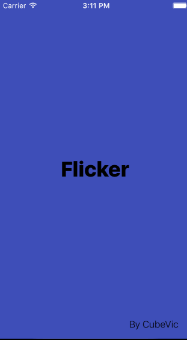

# Project 1 - *Flicker* 

**Flicker** is a movies app using the [The Movie Database API](http://docs.themoviedb.apiary.io/#).

Time spent: **18+** hours spent in total

## User Stories

The following **required** functionality is completed:

- [X] User can view a list of movies currently playing in theaters. Poster images load asynchronously.
- [X] User can view movie details by tapping on a cell.
- [X] User sees loading state while waiting for the API.
- [X] User sees an error message when there is a network error.
- [X] User can pull to refresh the movie list.

The following **optional** features are implemented:

- [X] Add a tab bar for **Now Playing** and **Top Rated** movies.
- [ ] Implement segmented control to switch between list view and grid view.
- [ ] Add a search bar.
- [X] All images fade in.
- [ ] For the large poster, load the low-res image first, switch to high-res when complete.
- [X] Customize the highlight and selection effect of the cell.
- [X] Customize the navigation bar.

The following **additional** features are implemented:

- [X] use SwiftHEXColors for manage the colors
- [X] Customize the StatusBar text color

## Video Walkthrough

Here's a walkthrough of implemented user stories:

GIF created with [LiceCap](http://www.cockos.com/licecap/).

## Notes

* i do try to add the searchBar but i couldn't manage the search intent, i did get to the point to understand how to implement the functions necessary to do it :(
* i couldn't implemente the UICollectionView in the same MoviesViewControlers :(
* i manage to customize the tabBar and the NavigationBar, as Well as the StatusBar but i couldn't reach the level i wanted, there is still little confusing :( 
*  i thing my code is still really messy i wanted to implement a model to handle the network request but i face probles to call the function :(

## License

    Copyright [2016] [Victor Fernandez]

    Licensed under the Apache License, Version 2.0 (the "License");
    you may not use this file except in compliance with the License.
    You may obtain a copy of the License at

        http://www.apache.org/licenses/LICENSE-2.0

    Unless required by applicable law or agreed to in writing, software
    distributed under the License is distributed on an "AS IS" BASIS,
    WITHOUT WARRANTIES OR CONDITIONS OF ANY KIND, either express or implied.
    See the License for the specific language governing permissions and
    limitations under the License.
